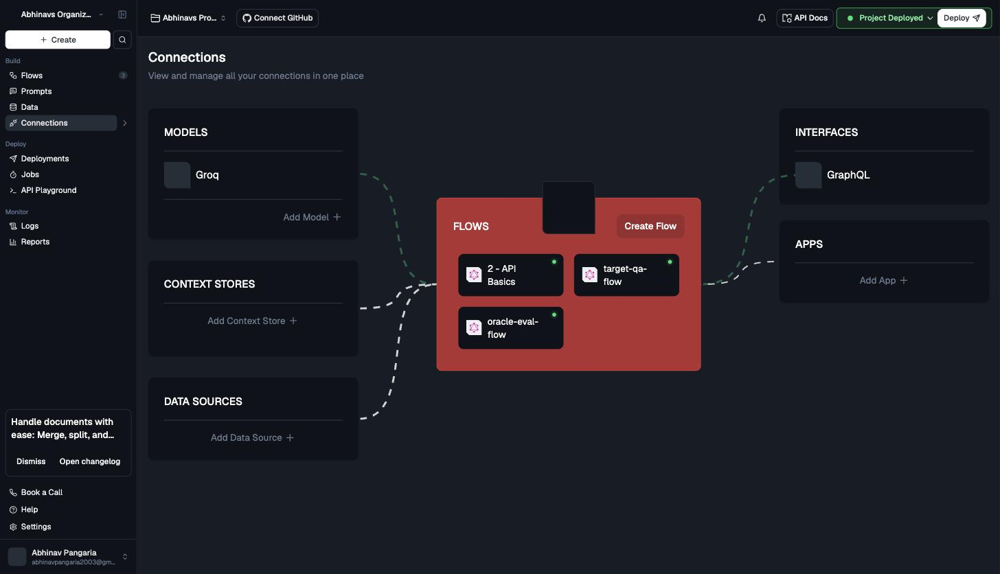
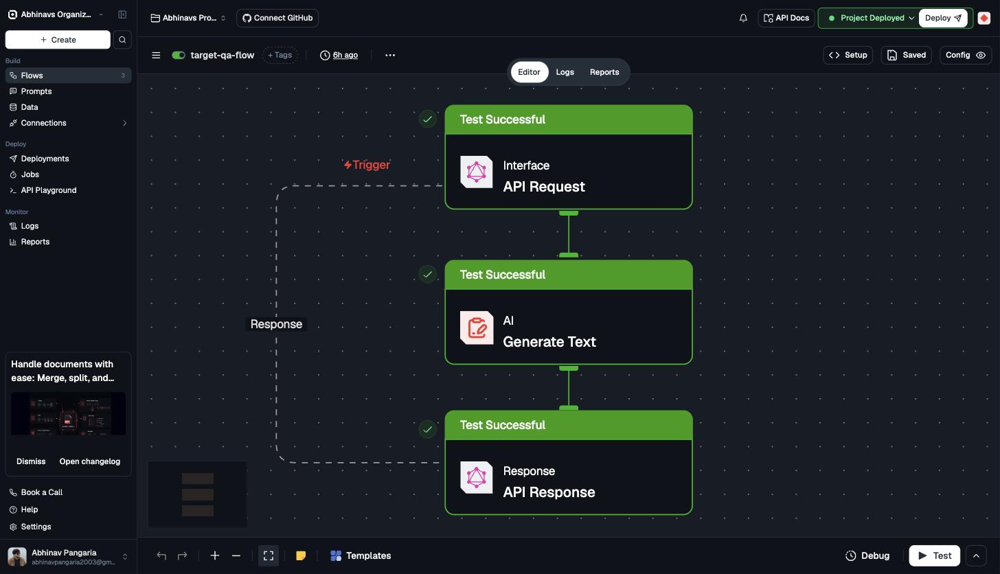
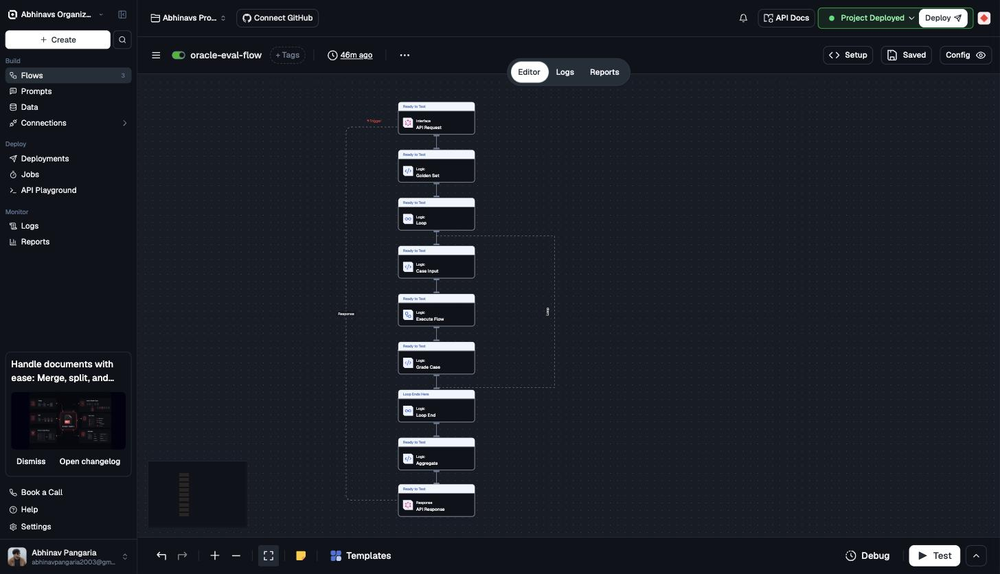
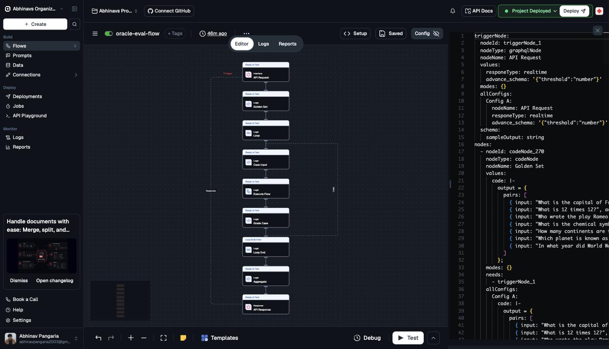

# Regression Oracle on Lamatic

An experiment in building an **LLM regression-testing "oracle"** entirely out of
[Lamatic.ai](https://lamatic.ai) flows — no new platform primitive, no external
runner. A golden set of question/answer pairs is replayed through a target flow
on every run, each answer is graded, and the flow returns a single pass/fail
summary that a CI job could gate a deploy on.

Both flows are **built in Lamatic Studio, deployed to the edge, and run
end-to-end over the GraphQL API**. Latest run: **7 / 7 cases pass, 0
regressions.**

---

## 1. The problem

Lamatic has good tooling for *does this flow run* — Flow Testing, Debugging,
Prompt Testing, Code Testing. All of them check execution success and
exact/structural output match. None of them answer the question that actually
breaks in production:

> After I changed a prompt / swapped a model / edited a flow, do the answers
> that used to be right **stay** right?

That is a **regression oracle**: a fixed set of inputs with known-good outputs,
replayed on every change, with a pass/fail verdict. There is no Eval Node, Judge
Node, or golden-set feature in Lamatic (checked against the docs and changelog
on 2026-09-07). The goal of this experiment was to find out whether the oracle
can be assembled from primitives that already exist, and to document what
building it actually takes.

---

## 2. What was built

Two flows in the project `AbhinavsOrganization694 / AbhinavsProject977`:

| Flow | ID | Role |
|------|----|----|
| `target-qa-flow` | `4f1f1bd3-9f6d-4634-aa46-637a6726c5a5` | System under test — a plain LLM Q&A flow (`question` in → `answer` out). |
| `oracle-eval-flow` | `86799705-51b6-45d7-881f-8240140eea46` | The oracle — replays the golden set through `target-qa-flow`, grades each answer, returns a pass/fail summary gated on a caller-supplied `threshold`. |

### Project overview

Groq is the only connected model provider; all three flows are deployed
(green dots); the GraphQL interface is the entry point.



### `target-qa-flow` — system under test

`API Request` (`graphqlNode`, `{"question":"string"}`) → `Generate Text`
(`LLMNode`, `groq/openai/gpt-oss-20b`, terse system prompt) → `API Response`
(`{"answer":"{{LLMNode_329.output.generatedResponse}}"}`). All three nodes
"Test Successful":



### `oracle-eval-flow` — the oracle



```
API Request  (triggerNode_1, graphqlNode)   payload: { threshold: Int }
  → Golden Set   codeNode_270      7 { input, accept } pairs, inline literal
  → Loop         forLoopNode_193   iterate over the 7 pairs
       → Case Input     codeNode_050   re-expose currentValue.{input, accept}
       → Execute Flow   flowNode_379   call target-qa-flow with the question
       → Grade Case     codeNode_500   normalize + substring match → { pass }
  → Loop End     forLoopEndNode_711
  → Aggregate    codeNode_600      count passes, compare to threshold, build table
  → API Response graphqlResponseNode   { pass, passed, failed, total, pass_rate,
                                         threshold, regressions, per_case_results }
```

The full node YAML is a transcript of the Studio Config tab:
[`flows/oracle-eval-flow.yaml`](flows/oracle-eval-flow.yaml). The Config tab
(Monaco YAML editor) round-trips — pasting a complete valid config there and
hitting Save syncs every node onto the canvas and persists.



### The grader is deterministic (not an LLM judge)

The golden answers are exact, unambiguous facts (Paris, 144, Mars, 1945, …), so
`codeNode_500` "Grade Case" does:

1. normalize both strings — lowercase, replace every non-alphanumeric run with a
   space, collapse whitespace, trim;
2. split the `accept` string on `|` into alternatives;
3. pass if any alternative is a substring of the normalized answer.

`pass = (passed count >= threshold)`. No second model, no score averaging,
nothing non-deterministic in the verdict. An `InstructorLLMNode` judge returning
`{score, reasoning}` is the right design when golden answers are open-ended
(summaries, explanations); it is written up as an alternative at the bottom of
`flows/oracle-eval-flow.yaml` but is deliberately **not** on the demo path —
fewer moving parts fail less often.

### The golden set

Seven pairs, inline in `codeNode_270`:

| Question | Accepts |
|----------|---------|
| What is the capital of France? | `paris` |
| What is 12 times 12? | `144` |
| Who wrote the play Romeo and Juliet? | `shakespeare` |
| What is the chemical symbol for the element gold? | `au` |
| How many continents are there on Earth? | `seven` or `7` |
| Which planet is known as the Red Planet? | `mars` |
| In what year did World War 2 end? | `1945` |

Inline for the demo so retrieval can't be the component that fails. The
productionized version would read these from a `memoryRetrieveNode` or a
dedicated table so non-engineers could edit cases in the UI —
[`flows/seed-golden-set-flow.yaml`](flows/seed-golden-set-flow.yaml) sketches
that (it is not built).

---

## 3. Result

Run with `threshold = 4` over the GraphQL `executeWorkflow` API:

```json
{
  "status": "success",
  "result": {
    "pass": true,
    "passed": 7,
    "failed": 0,
    "total": 7,
    "pass_rate": 1,
    "threshold": 4,
    "regressions": [],
    "per_case_results": [
      { "question": "What is the capital of France?",                    "accept": "paris",       "got": "Paris.",                                     "pass": true },
      { "question": "What is 12 times 12?",                              "accept": "144",         "got": "144.",                                       "pass": true },
      { "question": "Who wrote the play Romeo and Juliet?",              "accept": "shakespeare", "got": "William Shakespeare wrote Romeo and Juliet.", "pass": true },
      { "question": "What is the chemical symbol for the element gold?", "accept": "au",          "got": "Au",                                         "pass": true },
      { "question": "How many continents are there on Earth?",           "accept": "seven|7",     "got": "There are seven continents on Earth.",        "pass": true },
      { "question": "Which planet is known as the Red Planet?",          "accept": "mars",        "got": "Mars.",                                       "pass": true },
      { "question": "In what year did World War 2 end?",                 "accept": "1945",        "got": "World War II ended in 1945.",                 "pass": true }
    ]
  }
}
```

The `got` strings vary run to run — the target LLM is not deterministic — but
the normalize + substring grader matches every case on every run. Full proof and
the exact invocation: [`flows/DEMO-PROOF.md`](flows/DEMO-PROOF.md).

---

## 4. What we found (about Lamatic)

| Area | Finding |
|------|---------|
| **API surface** | The GraphQL API is **execute-only**: `executeWorkflow(workflowId, payload)` plus an async status poll. There is **no API to create or update a flow** — authoring is Studio-only (visual editor or the per-flow Config tab). Introspection is disabled. `executeWorkflow` returns a `WorkflowResponse`, so the selection set `{ result status }` is mandatory. |
| **No eval primitive** | No Eval / Judge / golden-set / regression feature exists. Flow Testing, Debugging, Prompt Testing, Code Testing all validate execution + output match only — no semantic quality scoring. The oracle has to be assembled from Loop + Execute Flow + Code nodes. |
| **Models are not pre-connected** | A fresh project has **zero** model providers. The pricing page's "300+ models" is not what you get until you add a credential. This project uses a user-added **Groq** credential (`groq-1`); only `gpt-oss-120b` / `gpt-oss-20b` are exposed through it. `target-qa-flow` standardizes on `groq/openai/gpt-oss-20b`. |
| **Config-tab YAML round-trips** | Pasting a complete, valid config into a flow's Config tab (Monaco editor) syncs **all** nodes onto the canvas, including brand-new ones. Save flips the badge to "Pending Deployments"; the **Deploy** button → "Deploy Project" dialog pushes to the edge. Studio then re-serializes the YAML canonically (reorders keys within `values` / `allConfigs`, reorders nodes) — cosmetic only. |
| **codeNode reference resolution** | A **bare** `{{nodeId.output.field}}` (not quoted, not backticked) **is** resolved — the JSON value is spliced in literally. A **backtick-wrapped** `` `{{nodeId.output.field}}` `` is **not** — it becomes the literal path string `"workflow.nodeId.output.field"`. References **more than one level past `.output`** do not resolve (`{{forLoopNode_193.output.currentValue.input}}` fails). |
| **Loop output shape** | `forLoopEndNode.output.loopOutput` is an **array**; each element is an object **keyed by nodeId**: `{ codeNode_050: {…}, flowNode_379: {…}, codeNode_500: { output: { question, accept, got, pass } } }`. The aggregator unwraps `element.codeNode_500.output`. |
| **Execute Flow templating** | `flowNode.values.requestInput` is a string, but a `{{…}}` inside it **does** render at execution time — the target flow received the real per-case questions. |
| **Trigger payload typing** | `[{{triggerNode_1.output}}][0].threshold` equals the value sent in the GraphQL `payload`. `threshold` must be typed **`Int`** in the query — a `Float` or a string is rejected. |
| **Misspelled key is real** | The trigger's response-type key is `responeType` (not `responseType`) — confirmed from a runtime dump, not a doc typo. Trigger input schema is `advance_schema`, a **JSON string**, not a map. |

---

## 5. Issues faced and how they were solved

| Issue | Fix |
|-------|-----|
| **Grade Case always read path strings, never values** (v1/v2 of the flow). | The refs were backtick-wrapped. Backticks suppress dereferencing in a codeNode. Switched every ref to a **bare splice** and wrapped maybe-undefined ones as `const x = [{{ref}}][0] || {};`. |
| **`{{forLoopNode_193.output.currentValue.input}}` returned nothing.** | codeNode refs don't resolve more than one level past `.output`. Added a `codeNode_050` "Case Input" that reads `currentValue` and re-exposes `.input` / `.accept` one level down for the nodes after it. |
| **The aggregator got an empty / wrongly-shaped list from the loop.** | `loopOutput` is an array of nodeId-keyed objects, not a flat list of results. `codeNode_600` now unwraps `element.codeNode_500.output` per iteration and tolerates all three plausible shapes. |
| **`executeWorkflow` rejected the `threshold` variable.** | It has to be a GraphQL `Int`. The query declares `$threshold: Int` and passes it inside `payload: { threshold: $threshold }`. |
| **No API to import the flow YAML.** | There isn't one — the `flows/*.yaml` files are transcripts. The flow was built by pasting the complete config into the Studio Config tab and hitting Save, then Deploy. |
| **A stale "Deploying the Project" modal blocked the canvas.** | Closed via its X; the deploy had in fact completed (Jobs ✓ + Edge Deployment ✓; the "Setting up Webhooks" spinner appears to hang but the deploy is done). |

---

## 6. How to replay the demo

### Prerequisites

- A Lamatic account with the two flows built and **deployed** in a project
  (structure and node YAML: `flows/oracle-eval-flow.yaml`,
  `flows/target-flow.yaml`).
- A connected model credential. This build used a **Groq** credential named
  `groq-1`; `target-qa-flow`'s LLM node uses `groq/openai/gpt-oss-20b`. Any
  chat model your project can reach will work — set it on the `Generate Text`
  node of `target-qa-flow`.
- An API key for the project.

### 1. Configure secrets locally

Create a `.env` in the repo root (it is git-ignored — see `.gitignore`):

```sh
PROJECT_ID=<your Lamatic project id>
API_KEY=<your Lamatic API key>
```

`.env` is never committed and the key is never printed by any command here.

### 2. Rebuild the flows in Studio (only if starting from scratch)

For each of `flows/target-flow.yaml` and `flows/oracle-eval-flow.yaml`: open the
flow in Studio, open the **Config** tab, paste the YAML body (the node
definitions — everything below the header comment), **Save**, then click
**Deploy** and confirm the "Deploy Project" dialog. `target-qa-flow` must be
deployed first; copy its flow ID into `flowNode_379.values.flowId` in
`oracle-eval-flow` before deploying the oracle.

### 3. Run the oracle over the API

```sh
# API_KEY and PROJECT_ID are read from ./.env (git-ignored, never printed)
set -a && . ./.env && set +a && curl -s -X POST \
  "https://abhinavsorganization694-abhinavsproject977.lamatic.dev/graphql" \
  -H "Authorization: Bearer ${API_KEY}" \
  -H "x-project-id: ${PROJECT_ID}" \
  -H "Content-Type: application/json" \
  -d '{"query":"query ExecuteWorkflow($workflowId: String!, $threshold: Int) { executeWorkflow(workflowId: $workflowId, payload: { threshold: $threshold }) { result status } }","variables":{"workflowId":"86799705-51b6-45d7-881f-8240140eea46","threshold":4}}' \
  | python3 -m json.tool
```

Replace the endpoint host and `workflowId` with your own. `threshold` is the
minimum number of cases that must pass for `result.pass` to be `true`.

### 4. Expected output

`status: "success"` and a `result` object with `pass`, `passed`, `failed`,
`total`, `pass_rate`, `threshold`, `regressions[]` and a `per_case_results[]`
table — see section 3. With the seven-case golden set and a healthy model,
`passed` is 7 and `regressions` is empty.

You can also run it from Studio: open `oracle-eval-flow`, click **Test**, and
pass `{ "threshold": 4 }`.

---

## 7. Repository layout

```
README.md                      this file
PLAN.md                        design notes + reasoning trail + verified schema facts
flows/
  oracle-eval-flow.yaml        the oracle — transcript of the deployed Config tab
  target-flow.yaml             the system under test — transcript of the deployed Config tab
  seed-golden-set-flow.yaml    NOT built — sketch of the Memory Store golden-set variant
  DEMO-PROOF.md                dated end-to-end run: invocation + full result JSON
docs/images/                   Studio screenshots referenced above
.env                           secrets — git-ignored, not in the repo
```

---

## 8. Notes and limitations

- The target LLM is non-deterministic; the grader is intentionally lenient
  (substring on normalized text) so that phrasing variance does not cause false
  regressions. Tighten it (exact match, per-case matchers) for stricter suites.
- The golden set is seven hand-picked factual questions — enough to demonstrate
  the mechanism, not a real coverage set.
- The CI "deploy gate" (fail the oracle → block the merge/deploy) is described
  but not implemented; it would sit on top of the same `executeWorkflow` call.
- Findings above are from Studio + API behaviour observed on 2026-09-07 and the
  docs as of that date; Lamatic may have changed since.
